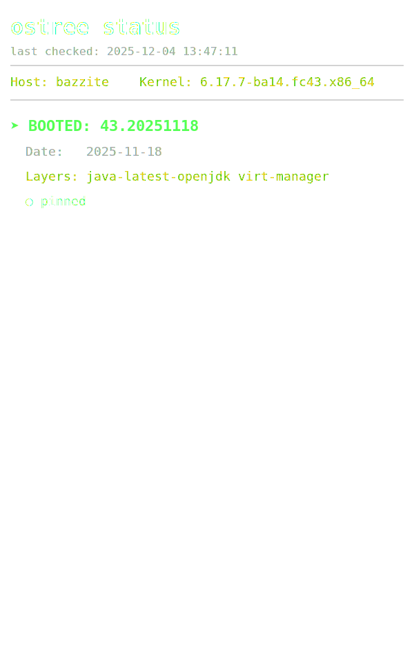

# Bazzite OSTree Status HUD

This lightweight utility generates a transparent SVG overlay for Bazzite (Fedora Atomic) desktops. It displays the currently booted OSTree deployment, kernel version, pinned status, and layered packages.

This project came about during a time where Bazzite had an updated version that caused problems with my Nvidia GPU and I wanted to quickly see after booting if I was on the version I preferred. It mushroomed a bit from there but the end result became more useful. 

Created with coding assistance from an LLM for speed. 

## Example SVG



## Features

* **Automated:** Updates on Boot, Login, System Updates, and Hourly.
* **System Aware:** Includes a system-level trigger to detect OS updates immediately.

### NOTE:

This will update on new upgrades being available and on reboot. It will *not* automatically trigger when you change ostree metadata like adding/removing pins. Not worth the extra effort, as if you really want to see the status after you make manual metadata changes you can just run the shell script manually. 

## Installation

### Option 1: Quick Download (Archive)

1. Download **[bazzite-hud.20251204.tar.gz](./bazzite-hud.20251204.tar.gz)**.
2. Extract the archive:
    ```bash
    tar -xzf bazzite-hud.20251204.tar.gz
    ```
3. Go to the Install and Load section

### Option 2: Manual Download

Or ... download the files individually.

* [bazzite-hud-svg.sh](./bazzite-hud-svg.sh)
* [bazzite-hud.user.service](./bazzite-hud.user.service)
* [bazzite-hud.user.timer](./bazzite-hud.user.timer)
* [bazzite-hud-trigger.system.service](./bazzite-hud-trigger.system.service)
* [bazzite-hud-trigger.system.path](./bazzite-hud-trigger.system.path)

## Install and Load

```bash
cp ./bazzite-hud-svg.sh ~/.local/bin/
chmod +x ~/.local/bin/bazzite-hud.svg
cp ./bazzite-hud.user.service ~/.config/systemd/user/
cp ./bazzite-hud.user.timer ~/.config/systemd/user/
cp ./bazzite-hud-trigger.system.service /etc/systemd/system/
cp ./bazzite-hud-trigger.system.path /etc/systemd/system/
# 1. Reload Configuration
systemctl --user daemon-reload
sudo systemctl daemon-reload
# 2. Enable User Timer (Updates on login & hourly)
systemctl --user enable --now bazzite-hud.user.timer
# 3. Enable System Watcher (Updates on OS upgrade)
sudo systemctl enable --now bazzite-hud-trigger.system.path
# 4. Generate first image
~/.local/bin/bazzite-hud-svg.sh
```

## Widget Configuration

This script works best with the standard Media Frame widget in KDE Plasma, but should be usable on other systems if you have a widget capable of displaying an image and polling for changes to the image.

1. Right-click desktop -> Add Widgets... -> Media Frame
2. Right-click the widget -> Configure Media Frame
3. General Settings:
    * Paths: Add File -> ~/Pictures/Wallpapers/bazzite-hud/status.svg
    * Update Interval: 10 seconds (Crucial for detecting updates, only polls system until a change is seen for minimal impact, increase time as you see fit)
    * Fill Mode: Preserve Aspect Fit.
4. Appearance: Disable background/frame for a transparent look.
